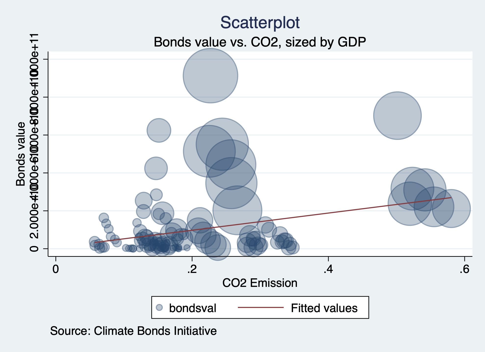
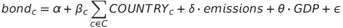
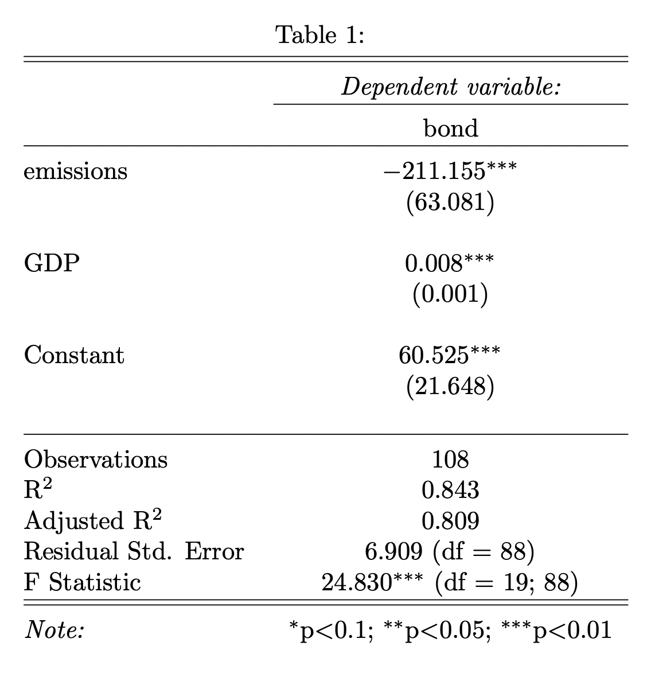

# Green Bonds and CO2 emissions

Diliara Sadykova, Van Nguyen, Phuoc Nguyen-Cuu, Omna Berhanu, Shirley Jiang

Our investigation aimed to explore financial instruments that quantify a country's investment in sustainable assets. Specifically, we examined the correlation between a country's carbon dioxide emissions and its investment in green bonds, while considering GDP as a factor.

## What are Green Bonds?
Bonds are debt securities that borrowers and investors utilize to raise funds, exchanging them for regular interest payments over the bond's lifespan. Green bonds, on the other hand, distinguish themselves from regular bonds by directing funds toward projects dedicated to sustainable climate and environmental initiatives. The World Bank issued the first green bonds in 2008 in response to a 2007 IPCC report linking human activity to climate change. However, their prominence surged in 2013 upon their introduction to the global financial markets. Today, these bonds are widely recognized for mobilizing capital for climate action and driving innovation.

## Data

We utilized datasets from reputable sources: Climate Bonds Interactive Data Platform, World Bank, and EDGAR (Emissions Database for Global Atmospheric Research). We focused on the 5-year period from 2016 to 2021, because the Paris Agreement, established in 2015 and implemented in 2016, played a pivotal role in global climate change efforts. Cleaning and merging these datasets were crucial steps in creating a master dataset that could be further analyzed to uncover relationships between variables and generate insightful graphs.

## Correlation

Countries with larger GDPs tend to invest more in green bonds. This suggests that economic strength may be a significant factor in promoting sustainable financing initiatives. Secondly, while there is a correlation between CO2 emissions and green bond investments, high CO2 emission countries do not necessarily invest more in green bonds compared to countries with much lower CO2 emissions. It is important to note that the value of green bonds alone may not provide a comprehensive picture of all investment activities related to the environment within a country. Other factors, such as private sector investments, government policies, and the presence of sustainable financial instruments beyond green bonds, can also contribute to environmental investment activities.

## Research Design
The following is the regression model:

where C is the set of countries including Australia, Brazil, Canada, China, Colombia, Finland, Germany, India, Italy, Japan, Netherlands, New Zealand, Norway, Philippines, Spain, Sweden, Switzerland, and the United States. The model regresses bond, the value of Green Bonds, against emissions - the level of Carbon Emissions.

The model controls for GDP since GDP is likely to be correlated with both emissions and the size of the financial markets of countries. Additionally, the model has Country-fixed effects to try to account for unobserved set differences between countries.

## Result
The result of the regression is presented in Table 1. The unit for emissions are in metric tons and units for bond and GDP are in billions of U.S. dollars. The results for Country-fixed effects are omitted.

